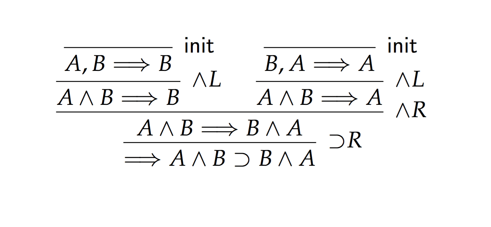

# sequents [](https://travis-ci.com/ayberkt/sequents)

**sequents** is an implementation of [Roy Dyckhoff's LJT](https://rd.host.cs.st-andrews.ac.uk/publications/jsl57.pdf)—a sequent
calculus for intuitionistic logic that is decidable and does _not_ need loop
checking

## Building

First make sure that you have `smlnj` installed. To compile, run
```
./script/build.sh
```

## Trying out

Let's prove the commutativity of conjunction `A ∧ B ⊃ B ∧ A`. Using the ASCII
approximations of the connectives, we can pipe this proposition into `sequents`.
```
➜ echo "A /\ B => B /\ A" | ./sequents
```
which gives the following:
```
• NTS  ---> A ∧ B ⊃ B ∧ A
  - Apply ⊃R.
  - New goal: A ∧ B ----> B ∧ A
• NTS A ∧ B ----> B ∧ A
  - Apply ∧R.
  - New goal: A ∧ B ----> B
  - New goal: A ∧ B ----> A
  • NTS A ∧ B ----> B
    - New goal: A, B ----> B
    - Apply ∧L.
  • NTS A, B ----> B
    - Note: B ∈ [A, B]
    - Apply init.
    - QED
  • NTS A ∧ B ----> A
    - New goal: A, B ----> A
    - Apply ∧L.
  • NTS A, B ----> A
    - Note: A ∈ [B, A]
    - Apply init.
    - QED
Proof found!
```

By the way, you can also generate LaTeX with `--latex` flag:
```
➜ echo "A /\ B => B /\ A" | ./sequents --latex > out.tex
➜ pdflatex out.tex
```

